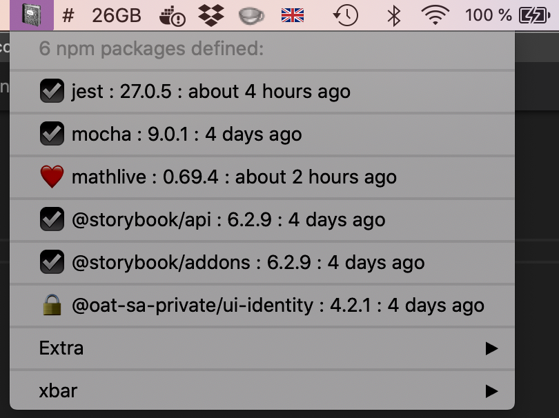

# The NPMJS Versions XBar (BitBar) Plugin

Puts NPM package stats & links in your Mac menu bar, using the `npm view` command.

Configure an unlimited number of NPM packages to display. See at a glance the latest released version of any package (public and private), and its modfication time. Click to launch the package's homepage.



## Prerequisites

This will run on systems with Mac OSX, [XBar](https://github.com/matryer/xbar) (or BitBar), [Node.js](https://nodejs.org/) >= 8 & [npm](https://www.npmjs.com/package/npm) >= 6 installed.

## Install

The basic idea is to

* (1) Clone the repo into your XBar plugins folder
* (2) `npm install` it
* (3) Symlink the entry point into your XBar plugins folder.

```sh
cd /path/to/your/xbar/plugins/folder
git clone https://github.com/mn113/npmjs-versions-xbar.git
cd npmjs-versions-xbar
npm install
ln -s src/npmjs-versions.2h.js ../npmjs-versions.2h.js
chmod +x ../npmjs-versions.2h.js
```

After that, the plugin icon should appear in the menubar when XBar is opened or refreshed.

## Configure

### Orgs & repos

Configure your list of orgs and packages in `config.json`, according to the template. Within `"enabled"` you can have as many blocks as you need, for different packages / orgs / scopes / custom properties.

Properties:

```js
{
  "enabled": [
    // one block (of multiple):
    {
      "org": "@oat-sa-private", // mandatory; set value to "org": "" for unscoped packages
      "packages": [
          "tao-test-runner-qtinui" // mandatory; list of package names
      ],
      "private": true, // optional; only used for default display icon
      "icon": ":heart:", // optional: custom icon for all packages in this group
      "url": "https://github.com/oat-sa/live-design-system" // optional; alternative url, in case package doesn't contain a homepage value (monorepos etc.)
    }
  ],
  "disabled": [] // holding area, for your convenience, not used anywhere
}
```

### Refresh frequency

As with all XBar plugins, the refresh time is encoded into the filename. The default `npmjs-versions.2h.js` will query NPM every 2 hours. Change `2h` to something like `15m`, `30m`, `1h` if you want more frequent updates.

## Customise

To customise your local version of the plugin, an easy place to start is the icons. To do this you can change the `*_ICON` constants defined near the top of the main script, `npmjs-versions.2h.js`.

## Limitations

XBar plugins are pretty good at fetching and showing information, but making them do something interactive is a real hassle. So don't expect to find many cool features in the future.

### Private packages

Some packages are private; to query these you need to be authenticated with NPM. You should obtain a [NPM access token](https://docs.npmjs.com/creating-and-viewing-access-tokens) with the correct permissions and install it in your `~/.npmrc` file. If you can run `npm view {scope}/{package}` on your command line and get a result, it should work in this plugin too. Tokens defined in ENV vars or in a project-local `.npmrc` file are not supported yet.

### Alternative package registries

Not tested, though it may work if your `~/.npmrc` is configured to use another registry by default.

## Contribute

Contributions & suggestions welcome by [Issue](issues) or [PR](pulls)!

## Licence

Distributed under the [MIT licence](./LICENSE).
